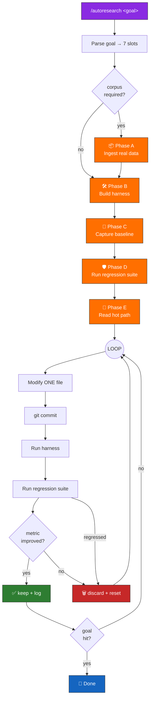

<div align="center">

# 🔬 Autoresearch Skill

### Autonomous, Goal-Directed Iteration for Claude Code

*Inspired by [Andrej Karpathy's autoresearch](https://github.com/karpathy/autoresearch) — extended into a universal, real-data benchmark-driven workflow for any engineering task.*

[](./SKILL.md)
[](https://docs.claude.com/en/docs/claude-code)
[](./LICENSE)
[](https://github.com/karpathy/autoresearch)
[](#)

```

          ╔════════════════════════════════════════════════════╗
          ║   MODIFY → VERIFY → REGRESS → KEEP / DISCARD → ∞   ║
          ╚════════════════════════════════════════════════════╝

```

</div>

---

## ✨ What is this?

**Autoresearch** is a Claude Code skill that turns a free-form goal like

```
/autoresearch reduce API p95 latency to 200ms
```

into an **autonomous, self-correcting optimization loop** that:

1. 🧠 **Parses the goal** into seven machine-readable slots
2. 📦 **Ingests real data** (refusing synthetic corpora)
3. 🛠️ **Builds a single-file benchmark harness**
4. 📐 **Captures a baseline** + regression test count
5. 🔁 **Iterates** — one atomic change at a time
6. ✅ **Keeps wins**, 🗑️ **auto-discards regressions**, logs everything
7. 🏁 **Stops** when the target metric is hit

No hand-holding. No "should I continue?" Just mechanical iteration until the goal is reached.

---

## 🌟 Why use it?

<table>
<tr>
<td width="50%">

### 🎯 Mechanical, not subjective
Every iteration is judged by a single floating-point metric extracted from a command. "Looks better" is banned.

</td>
<td width="50%">

### 🛡️ Regression-proof
A hard gate rolls back any change that drops a pre-existing passing test — no matter how big the win looked.

</td>
</tr>
<tr>
<td>

### 📊 Real data only
The harness refuses synthetic corpora. If you can't scrape, export, or tail it from reality, the loop won't start.

</td>
<td>

### ♻️ Atomic & reversible
One change per iteration, git-committed before verification. A failed experiment is always `git reset --hard HEAD~1` away.

</td>
</tr>
<tr>
<td>

### 🧩 Domain-agnostic
Backend latency, test coverage, bundle size, flakiness, LOC, build time, lighthouse scores — same loop, different metric.

</td>
<td>

### 🌐 Global Claude Code skill
Install once under `~/.claude/skills/autoresearch/` and invoke `/autoresearch <goal>` from any project.

</td>
</tr>
</table>

---

## 🚀 Quick Start

### 1. Install (global skill)

```bash
# Clone into your Claude Code skills directory
git clone https://github.com/Muminur/autoresearch-skill-Andrej-Karpathy.git \
  ~/.claude/skills/autoresearch
```

On Windows:
```powershell
git clone https://github.com/Muminur/autoresearch-skill-Andrej-Karpathy.git `
  "$env:USERPROFILE\.claude\skills\autoresearch"
```

### 2. Invoke

Open Claude Code in any project and type:

```
/autoresearch reduce avg_latency_ms below 500
```

Claude will print the parsed slot dump, walk through the five harness phases, then begin the autonomous loop.

### 3. Watch it work

Results are appended to `autoresearch/results.tsv` in your project:

```tsv
commit    metric     avg_latency_ms  status      description
953b71d   1.000000   2008.9          baseline    77-case corpus, 10 signals executed
953b71d   1.000000   646.4           keep        parallelize _place_exits with asyncio.gather
953b71d   1.000000   592.1           keep        add 30s TTL cache on account()
953b71d   1.000000   488.8           keep        prewarm account+connection pool, serialize signals
```

---

## 🧭 How it works



---

## 🎛️ Subcommands

| Command | Purpose |
|---------|---------|
| `/autoresearch <goal>` | **Default path** — parse free-form goal, build harness, loop until goal met |
| `/autoresearch` | Bare autonomous loop (assumes scope/metric/verify already defined) |
| `/autoresearch:plan` | Interactive wizard: Goal → Scope → Metric → Verify |
| `/autoresearch:security` | Autonomous security audit (STRIDE + OWASP Top 10 + red-team personas) |

Chain with Claude Code's `/loop` for bounded runs:

```
/loop 25 /autoresearch reduce bundle size below 200KB
```

---

## 🧩 Goal-parsing rubric

When you type `/autoresearch <goal>`, Claude extracts seven slots from your free-form text:

| Slot | Example | Fallback |
|------|---------|----------|
| **metric** | `latency`, `reliability`, `coverage`, `flakiness`, `bundle size` | Ask user |
| **direction** | `reduce/lower/minimise` → min · `raise/maximise` → max | Inferred from noun |
| **target** | `500ms`, `95%`, `0%`, `<200KB` | "best achievable" (unbounded) |
| **scope** | Files matching goal domain terms | Whole repo minus deps |
| **corpus_source** | `prod logs`, `fixtures`, `scraped data` | Required for empirical metrics |
| **verify_cmd** | `python benchmark.py` | Constructed during Phase B |
| **regression_cmd** | `pytest -q`, `npm test`, `cargo test`, `go test ./...` | Auto-detected |

Three worked examples:

```
/autoresearch reduce API p95 latency to 200ms
→ metric=p95_latency_ms, direction=minimise, target=200, verify_cmd=python benchmark.py

/autoresearch reduce test flakiness to 0%
→ metric=flaky_test_rate, direction=minimise, target=0, corpus=CI run history

/autoresearch increase signal-parser reliability to 99%
→ metric=reliability, direction=maximise, target=0.99, regression_cmd=pytest -q
```

---

## 🏗️ The Harness Protocol

The default path runs through five mandatory phases before the loop begins.

```mermaid
sequenceDiagram
    autonumber
    participant User
    participant Claude
    participant Repo
    participant Tests

    User->>Claude: /autoresearch &lt;goal&gt;
    Claude->>Claude: Parse goal → 7 slots
    Claude->>User: Print parsed-slot dump

    Note over Claude,Repo: 📦 Phase A — Corpus Ingestion
    Claude->>Repo: Scrape/locate real data
    Claude->>Repo: Write autoresearch/data/*.jsonl
    Claude-->>User: corpus: N cases from &lt;source&gt;

    Note over Claude,Repo: 🛠️ Phase B — Harness Construction
    Claude->>Repo: Write benchmark.py (single file)
    Claude->>Claude: verify stdout == "metric: &lt;float&gt;"

    Note over Claude,Repo: 📐 Phase C — Baseline Capture
    Claude->>Repo: Run benchmark.py
    Claude->>Repo: Append iteration #0 to results.tsv

    Note over Claude,Tests: 🛡️ Phase D — Regression Gate
    Claude->>Tests: Run pytest -q (or equivalent)
    Claude->>Repo: Record N_pre in .regression-baseline

    Note over Claude,Repo: 🔎 Phase E — Hot-Path Reading
    Claude->>Repo: Trace entry → handler → I/O
    Claude-->>User: 3-5 candidate ideas

    loop Until goal hit or interrupted
        Claude->>Repo: Modify ONE file
        Claude->>Repo: git commit
        Claude->>Repo: Run benchmark.py
        Claude->>Tests: Run regression suite
        alt regression passed && metric improved
            Claude->>Repo: status=keep
        else regression failed OR metric worse
            Claude->>Repo: git reset --hard HEAD~1
            Claude->>Repo: status=discard
        end
    end
```

Full protocol: [`references/benchmark-harness.md`](./references/benchmark-harness.md)

---

## 🛡️ The Eleven Critical Rules

<table>
<tr><td>

1. **Loop until done** — unbounded: loop forever; bounded: loop N then summarize
2. **Read before write** — full context before any modification
3. **One change per iteration** — atomic, attributable
4. **Mechanical verification only** — no subjective judgments
5. **Automatic rollback** — failed changes revert instantly
6. **Simplicity wins** — equal result + less code = keep

</td><td>

7. **Git is memory** — every kept change commits; agent reads history
8. **When stuck, think harder** — re-read, combine near-misses, try radical
9. **Real data only** — synthetic cases forbidden
10. **Regression gate is absolute** — drop a test, auto-discard
11. **Harness is read-only** — harness edits need a `harness:` commit

</td></tr>
</table>

---

## 📊 Real-world case study

Executed in this project (WhatsApp Signal Trader on Binance testnet):

| Iteration | Change | Metric (avg latency) | Reliability | Status |
|-----------|--------|---------------------:|:-----------:|:------:|
| #0 | baseline | **2008.9 ms** | 1.000 | baseline |
| #1 | parallelize exit-order placement with `asyncio.gather` | **646.4 ms** | 1.000 | ✅ keep |
| #2 | 30s TTL cache on signed `/api/v3/account` | **592.1 ms** | 1.000 | ✅ keep |
| #3 | prewarm account + TCP pool, serialize signals with Sem(1) | **488.8 ms** | 1.000 | ✅ keep |

**Result:** **2008 ms → 488 ms (76% reduction)** with **zero regressions** across 373 pre-existing tests. Goal of `< 500ms` achieved in 3 iterations.

---

## 📁 File structure

```
autoresearch/
├── SKILL.md                             # Entry point read by Claude Code
├── README.md                            # This file
├── LICENSE                              # MIT
└── references/
    ├── core-principles.md               # 7 generalisable Karpathy principles
    ├── autonomous-loop-protocol.md      # Phase-by-phase loop rules
    ├── benchmark-harness.md             # Corpus + harness + regression gate
    ├── results-logging.md               # TSV schema for iteration logs
    ├── plan-workflow.md                 # /autoresearch:plan wizard
    └── security-workflow.md             # /autoresearch:security audit
```

---

## 🧬 Domain adaptability

| Domain | Metric | Scope | Verify | Corpus Source |
|--------|--------|-------|--------|---------------|
| Backend code | Tests pass + coverage % | `src/**/*.ts` | `npm test` | test fixtures |
| Frontend UI | Lighthouse score | `src/components/**` | `npx lighthouse` | staging URLs |
| ML training | val_bpb / loss | `train.py` | `uv run train.py` | training dataset |
| Blog/content | Word count + readability | `content/*.md` | custom script | source manuscripts |
| Performance | Benchmark time (ms) | target files | `npm run bench` | benchmark inputs |
| Refactoring | Tests pass + LOC reduced | target module | `npm test && wc -l` | existing test suite |
| Security | OWASP + STRIDE coverage | API/auth/middleware | `/autoresearch:security` | codebase |
| Real-traffic perf | p95 latency (ms) | hot-path files | `python benchmark.py` | prod log tail |

---

## 🙏 Credit & Inspiration

<div align="center">

### Built on the shoulders of giants.

</div>

- **[Andrej Karpathy](https://github.com/karpathy/autoresearch)** — for the original autoresearch pattern: *single file, single metric, iterate*.
- **[Strix](https://github.com/usestrix/strix)** — adversarial AI security testing with PoC validation (inspiration for `/autoresearch:security`).
- **OWASP Top 10** — the industry-standard vulnerability taxonomy.
- **STRIDE** — Microsoft's threat-modeling framework.

The core insight from Karpathy that drives every design decision here:

> *Autonomy scales when you constrain scope, clarify success, mechanize verification, and let agents optimize tactics while humans optimize strategy.*

---

## 📝 License

MIT — see [LICENSE](./LICENSE).

---

<div align="center">

**If this skill saves you a milestone's worth of manual tuning, a ⭐ on the repo is appreciated.**

[Report an issue](https://github.com/Muminur/autoresearch-skill-Andrej-Karpathy/issues) · [Open a PR](https://github.com/Muminur/autoresearch-skill-Andrej-Karpathy/pulls)

</div>
